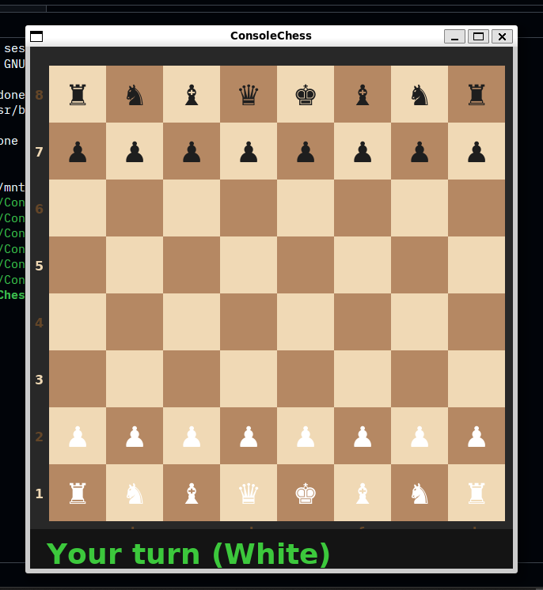

# ConsoleChess ♟️

A fully playable chess game built in C++ with an SDL2 GUI and a minimax AI opponent with alpha-beta pruning.

## Features

- 🎮 Click-to-move GUI built with SDL2
- 🤖 AI opponent using minimax algorithm with alpha-beta pruning (depth 3)
- ✅ Full move validation for all pieces
- 🟢 Valid move indicators when a piece is selected
- 🔴 Check detection with king highlight
- 🏁 Checkmate and stalemate detection
- 📋 Coordinate labels on the board

## Screenshots



## Tech Stack

- **Language:** C++ 17
- **Graphics:** SDL2 + SDL2_ttf
- **Build System:** CMake

## Getting Started

### Prerequisites

- Linux / WSL (Ubuntu)
- CMake 3.15+
- SDL2 and SDL2_ttf

Install dependencies on Ubuntu:

```bash
sudo apt install libsdl2-dev libsdl2-ttf-dev build-essential cmake
```

### Build & Run

```bash
git clone https://github.com/cyberbrolly/ConsoleChess.git
cd ConsoleChess
mkdir build && cd build
cmake ..
make
./ConsoleChess
```

## How to Play

- Click a **white piece** to select it
- Green dots show valid moves
- Click a destination square to move
- The AI (Black) responds automatically
- The game detects check, checkmate, and stalemate

## Project Structure